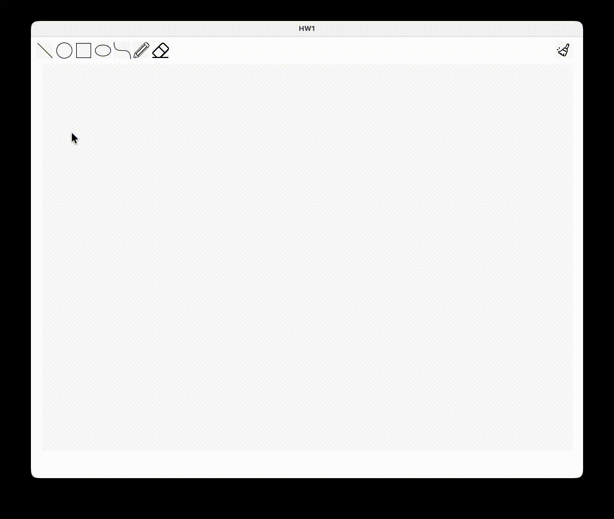
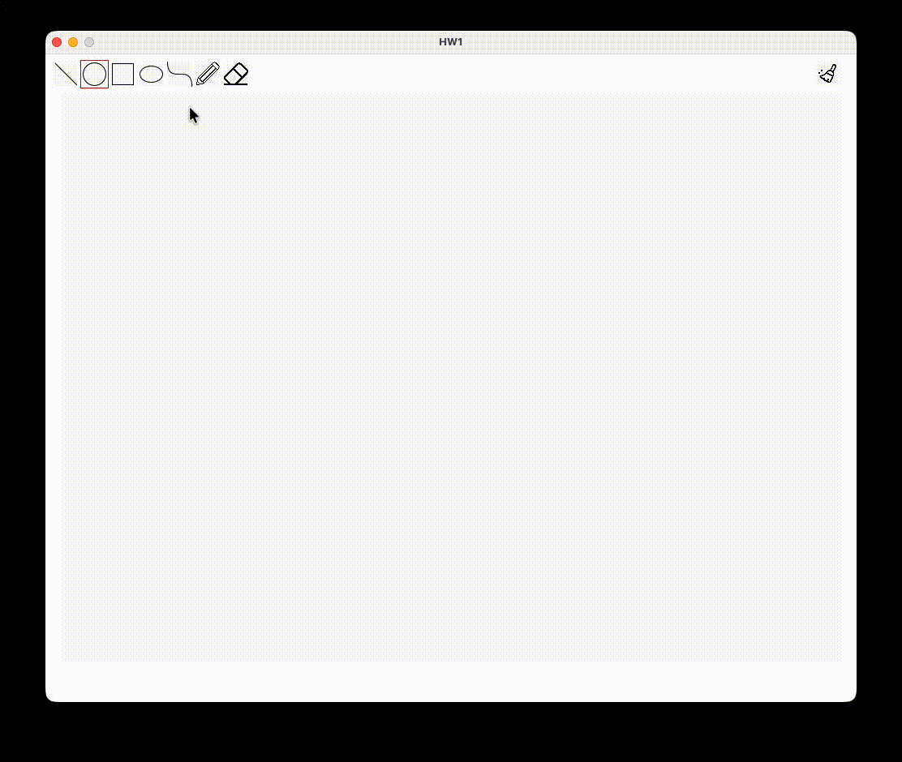
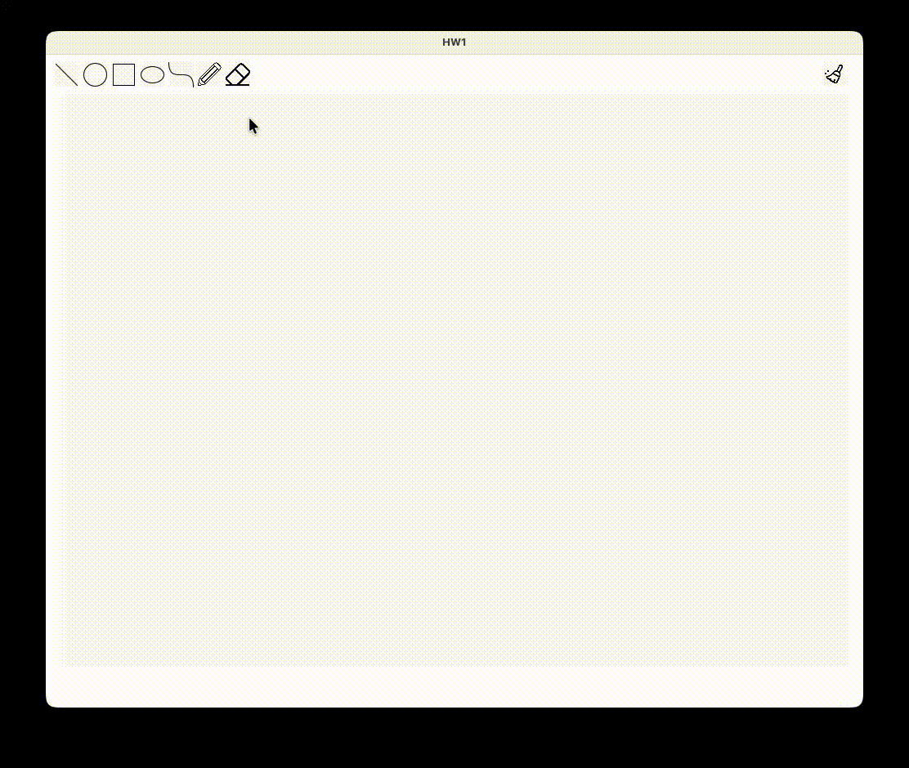
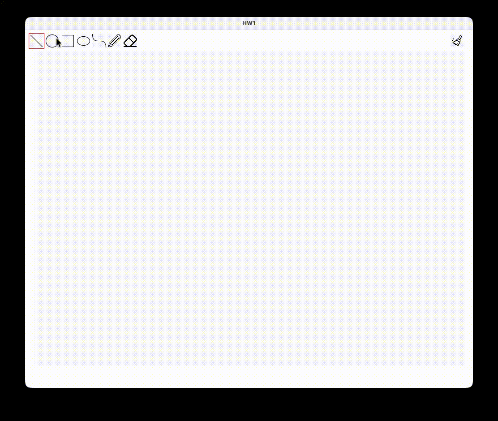
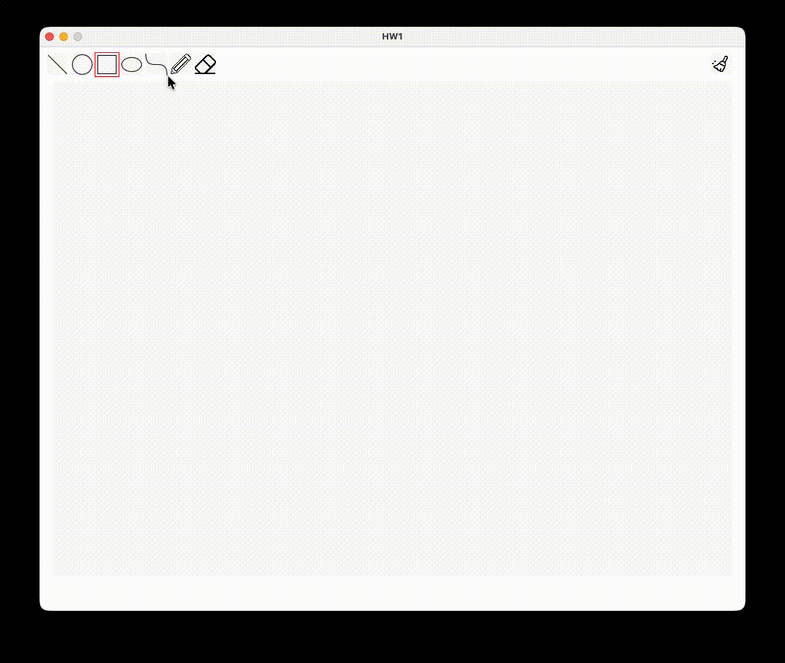
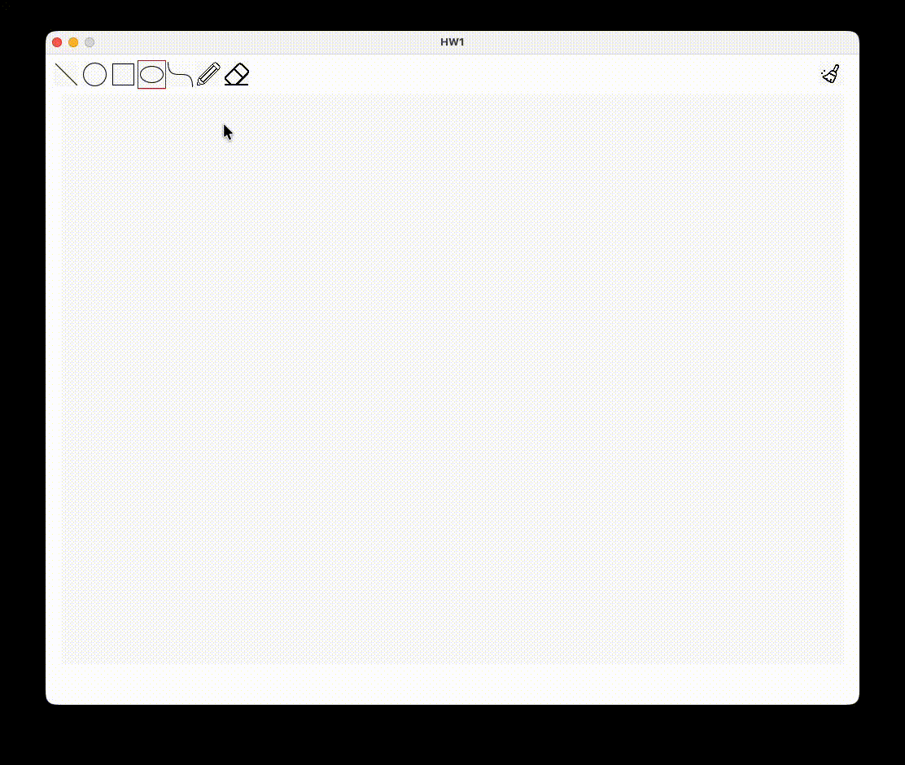
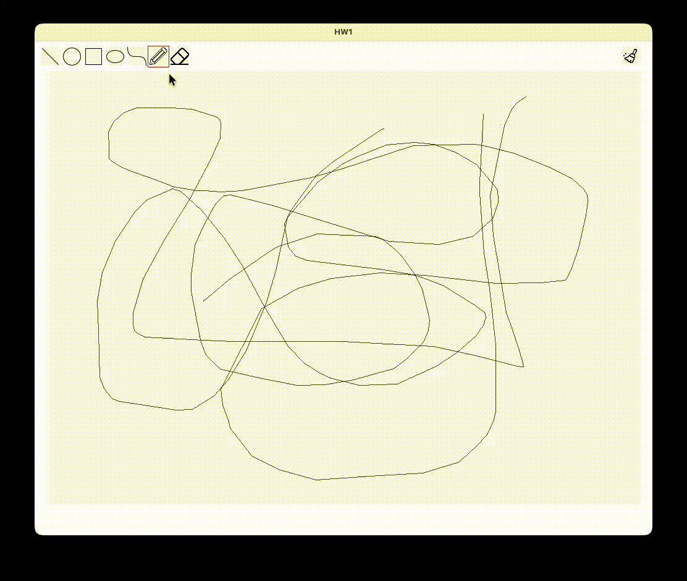

# HW1

## Grading

### Fundamentals

| # | Content | Score | Finished |
|---|---------|-------|----------|
| 1 | Correctly implement the line algorithm | 25% | ✅ |
| 2 | Correctly implement the circle algorithm | 25% | ✅ |
| 3 | Correctly implement the ellipse algorithm | 15% | ✅ |
| 4 | Correctly implement the curve algorithm | 15% | ✅ |
| 5 | Correctly implement the eraser | 20% | ✅ |

### Bonus

| # | Content | Score | Finished |
|---|---------|-------|----------|
| 1 | Add some features that were not present in this assignment | 1.5 Semester Score | ❌ |

---

## Implementation Details

### 1. Line Algorithm

- Use Midpoint line algorithm to draw lines.
  - [`CGLine_Midpoint`](util.pde)
- Use Bresenham's line algorithm to draw lines.
  - [`CGLine_Bresenham`](util.pde)

---

### 2. Circle Algorithm

- Use Midpoint circle algorithm to draw circles.
  - [`CGCircle_Midpoint`](util.pde)

---

### 3. Ellipse Algorithm

- Use Midpoint ellipse algorithm to draw ellipses.
  - [`CGEllipse_Midpoint`](util.pde)

---

### 4. Curve Algorithm

- Use Bernstein polynomials to draw curves.
  - [`CGCurve_Bernstein`](util.pde)
- Use De Casteljau's algorithm to draw curves.
  - [`CGCurve_DeCasteljau`](util.pde)

---

### 5. Eraser

- Use white rectangle to cover the area.
  - [`CGEraser`](util.pde)

---

## References
- [Bresenham's line algorithm](https://en.wikipedia.org/wiki/Bresenham's_line_algorithm)
- [Bresenham's Line Algorithm - Demystified Step by Step](https://www.youtube.com/watch?v=CceepU1vIKo)
- [Xiaolin Wu's Line Algorithm - Rasterizing Lines with Anti-Aliasing](https://www.youtube.com/watch?v=f3Rs20k-hcI&t=1s)
- [How Your Computer Draws Lines](https://www.youtube.com/watch?v=8gIhNSAXYcQ)
- [Midpoint circle algorithm](https://en.wikipedia.org/wiki/Midpoint_circle_algorithm)
- [The Midpoint Circle Algorithm Explained Step by Step](https://www.youtube.com/watch?v=hpiILbMkF9w)
- [Midpoint ellipse drawing algorithm](https://www.geeksforgeeks.org/dsa/midpoint-ellipse-drawing-algorithm/)
- [De Casteljau's algorithm](https://en.wikipedia.org/wiki/De_Casteljau's_algorithm)
- [Splines and Bézier Curves and their application in Video Games](https://www.gameludere.com/2021/05/13/splines-and-bezier-curves-and-their-application-in-video-games/)
- [The Beauty of Bézier Curves](https://www.youtube.com/watch?v=aVwxzDHniEw)
- [The Continuity of Splines](https://www.youtube.com/watch?v=jvPPXbo87ds)
- [How Computers Draw Curves - Bézier Curves Explained](https://www.youtube.com/watch?v=ABBknLY1L4o&t=172s)