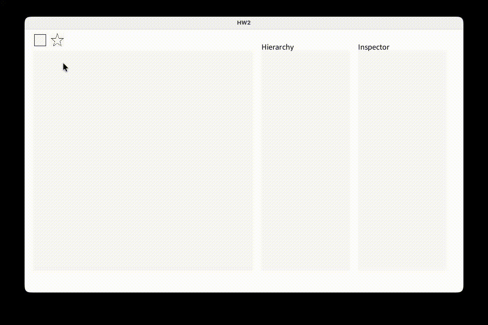
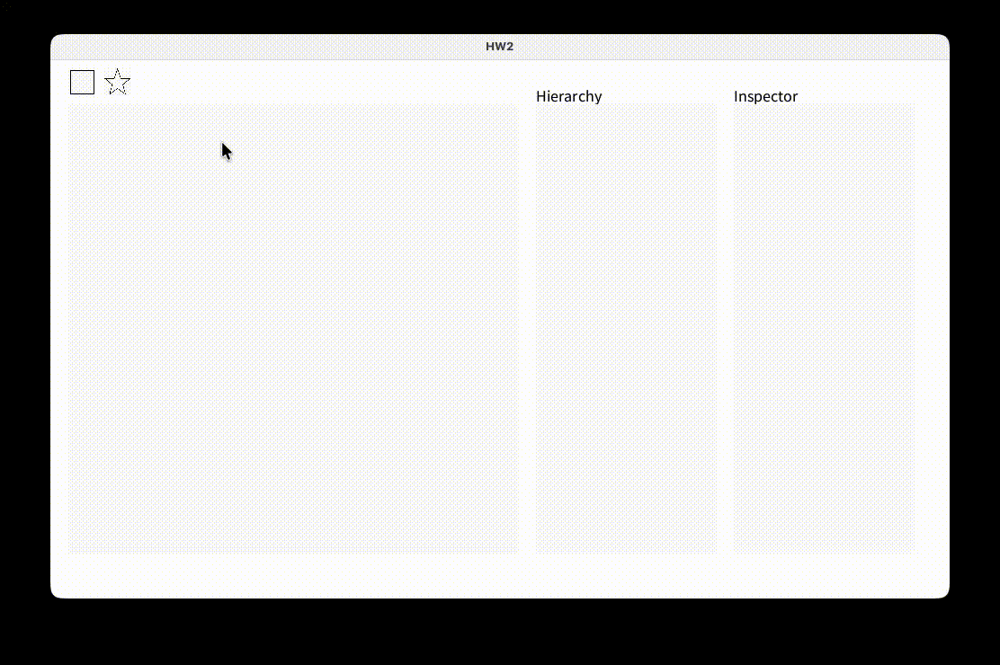

# HW2

## Grading

### Fundamentals
| # | Content | Score | Finished |
|---|---------|-------|----------|
| 1 | Correctly implement the 3 transformation matrices. | 20% | ✅ |
| 2 | Correctly implement pnpoly. | 25% | ✅ |
| 3 | Correctly implement the bounding box. | 20% | ✅ |
| 4 | Correctly implement Sutherland Hodgman Algorithm. | 35% | ✅ |

### Bonus
| # | Content | Score | Finished |
|---|---------|-------|----------|
| 1 | Successfully implement SSAA | 1.5 Semester Score | ❌ |

---

## Implementation Details

### 1. Transformation Matrices
- Implement the translation matrix.
  - [`makeTrans()`](./Matrix4.pde)
- Implement the scaling matrix.
  - [`makeScale()`](./Matrix4.pde)
- Implement the rotation matrix.
  - [`makeRotX()`](./Matrix4.pde)
  - [`makeRotY()`](./Matrix4.pde)
  - [`makeRotZ()`](./Matrix4.pde)

---

### 2. Pnpoly
- Implement the pnpoly(ray-casting algorithm) to determine if a point is inside a polygon.
  - [`pnpoly()`](./util.pde)

---

### 3. Bounding Box
- Implement the bounding box algorithm to find the axis-aligned bounding box of a polygon.
  - [`findBoundBox()`](./util.pde)

---

### 4. Sutherland Hodgman Algorithm
- Implement the Sutherland Hodgman algorithm to clip a polygon against a convex clipping window.
  - [`Sutherland_Hodgman_algorithm()`](./util.pde)

---

## References

### Online Articles
- [Sutherland–Hodgman algorithm](https://en.wikipedia.org/wiki/Sutherland–Hodgman_algorithm)

### YouTube Videos
- [Math for Game Developers: Why do we use 4x4 Matrices in 3D Graphics?](https://youtu.be/Do_vEjd6gF0?si=ktVbapxgmtOycc40)
- [Checking if a point is inside a polygon is RIDICULOUSLY simple (Ray casting algorithm) - Inside code](https://youtu.be/RSXM9bgqxJM?si=EhPK27d02Ahtb1I2)
- [Sutherland-Hodgman Polygon Clipping Algorithm](https://youtu.be/S091lKYWbSs?si=3kh2rk4uhglesyU2)
