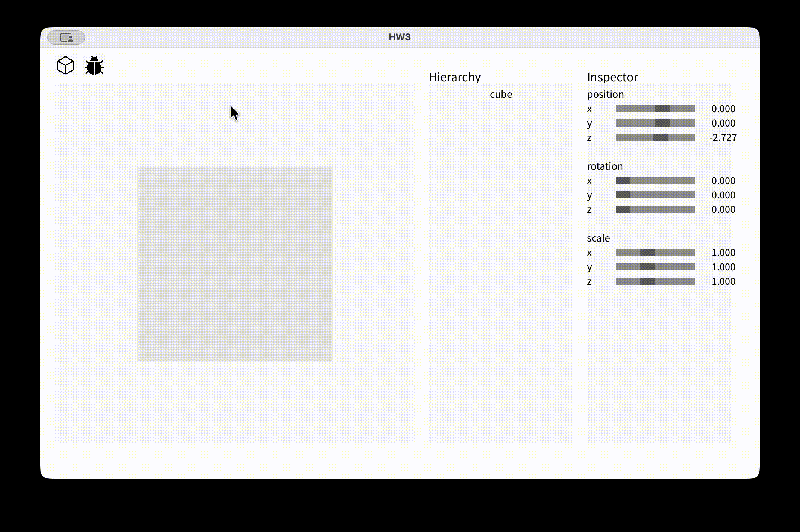
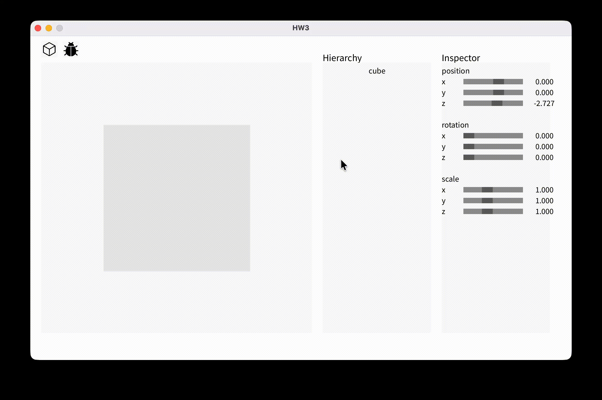

# HW3

## Grading

### Fundamentals
| # | Content | Score | Finished |
|---|---------|-------|----------|
| 1 | Correctly implement the 3 matrices. | 40% | ✅ |
| 2 | Correctly implement depth buffer. | 20% | ✅ |
| 3 | Correctly implement camera control. | 20% | ✅ |
| 4 | Correctly implement backculling. | 20% | ✅ |

### Bonus
| # | Content | Score | Finished |
|---|---------|-------|----------|
| 1 | Successfully implement 3D clipping. | 1.5 Semester Score | ❌ |

---

## Implementation Details

### 1. 3 Matrices
- Implement the rotation matrix.
  - [`makeRotX()`](./Matrix4.pde)
  - [`makeRotY()`](./Matrix4.pde)
- Implement the local to world matrix.
  - [`GameObject.makeLocalToWorld()`](./GameObject.pde)



---

### 2. Depth Buffer
- Implement the depth buffer to calculate the depth of a pixel on a triangle.
  - [`getDepth()`](./util.pde)



---

### 3. Camera Control
- Implement the view matrix.
  - [`Camera.setPositionOrientation()`](./Camera.pde)
- Implement the projection matrix.
  - [`Camera.setSize()`](./Camera.pde)
- Implement the camera control to move the camera using keyboard.
  - [`cameraControl()`](./HW3.pde)

You can use `W`, `A`, `S`, `D`, `Q`, `E` to move the camera forward, left, backward, right, up, and down respectively.


---

### 4. Backculling
- Implement backface culling to skip rendering faces that are not visible to the camera.
  - [`GameObject.debugDraw()`](./GameObject.pde)

In `GameObject.debugDraw()`, replace the original code:

```java
void debugDraw() {
    Matrix4 MVP = main_camera.Matrix().mult(localToWorld());
    for (int i = 0; i < mesh.triangles.size(); i++) {
        Triangle triangle = mesh.triangles.get(i);
        Vector3[] img_pos = new Vector3[3];
        for (int j = 0; j < 3; j++) {
            img_pos[j] = MVP.mult(triangle.verts[j].getVector4(1.0)).homogenized();
        }

        for (int j = 0; j < img_pos.length; j++) {
            img_pos[j] = new Vector3(map(img_pos[j].x, -1, 1, renderer_size.x, renderer_size.z),
                    map(img_pos[j].y, -1, 1, renderer_size.y, renderer_size.w), img_pos[j].z);
        }

        CGLine(img_pos[0].x, img_pos[0].y, img_pos[1].x, img_pos[1].y);
        CGLine(img_pos[1].x, img_pos[1].y, img_pos[2].x, img_pos[2].y);
        CGLine(img_pos[2].x, img_pos[2].y, img_pos[0].x, img_pos[0].y);
    }
}
```

with the following code:

```java
void debugDraw() {
    Matrix4 MVP = main_camera.Matrix().mult(localToWorld());
    Vector3 camPos = main_camera.transform.position;
    for (int i = 0; i < mesh.triangles.size(); i++) {
        Triangle triangle = mesh.triangles.get(i);

        // Compute world space positions of triangle vertices
        Vector3 v0 = localToWorld().mult(triangle.verts[0].getVector4(1.0)).homogenized();
        Vector3 v1 = localToWorld().mult(triangle.verts[1].getVector4(1.0)).homogenized();
        Vector3 v2 = localToWorld().mult(triangle.verts[2].getVector4(1.0)).homogenized();

        // Compute face normal
        Vector3 edge1 = v1.sub(v0);
        Vector3 edge2 = v2.sub(v0);
        Vector3 normal = Vector3.cross(edge1, edge2).unit_vector();

        // Vector from triangle to camera
        Vector3 toCamera = camPos.sub(v0).unit_vector();

        // Backface culling: skip if normal is facing away from camera
        if (Vector3.dot(normal, toCamera) < 0) continue;

        // Project to screen
        Vector3[] img_pos = new Vector3[3];
        for (int j = 0; j < 3; j++) {
            img_pos[j] = MVP.mult(triangle.verts[j].getVector4(1.0)).homogenized();
        }

        for (int j = 0; j < img_pos.length; j++) {
            img_pos[j] = new Vector3(map(img_pos[j].x, -1, 1, renderer_size.x, renderer_size.z),
                    map(img_pos[j].y, -1, 1, renderer_size.y, renderer_size.w), img_pos[j].z);
        }
        
        CGLine(img_pos[0].x, img_pos[0].y, img_pos[1].x, img_pos[1].y);
        CGLine(img_pos[1].x, img_pos[1].y, img_pos[2].x, img_pos[2].y);
        CGLine(img_pos[2].x, img_pos[2].y, img_pos[0].x, img_pos[0].y);
    }
}
```


---

### Bonus. 3D Clipping

---

## References

### Online Articles
- [Article - World, View and Projection Transformation Matrices](https://www.codinglabs.net/article_world_view_projection_matrix.aspx)
- [Z-buffering](https://en.wikipedia.org/wiki/Z-buffering)
- [Back-face culling](https://en.wikipedia.org/wiki/Back-face_culling)

### YouTube Videos
- [Quick Understanding of Homogeneous Coordinates for Computer Graphics](https://youtu.be/o-xwmTODTUI?si=WpRfaWFyYXUpEFyo)
- [The Math behind (most) 3D games - Perspective Projection](https://youtu.be/U0_ONQQ5ZNM?si=tMYxjLhAYZOIndgM)